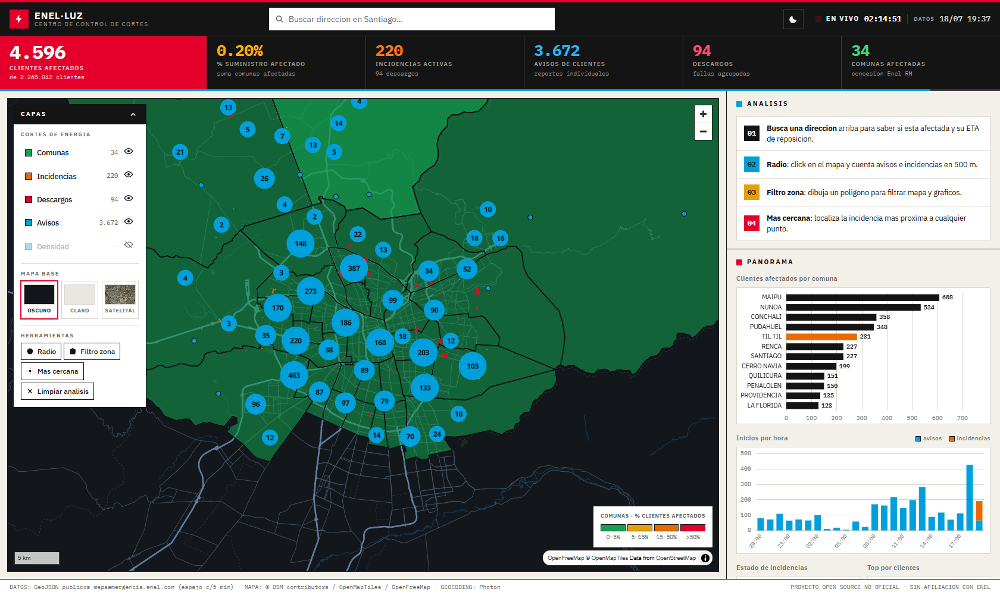
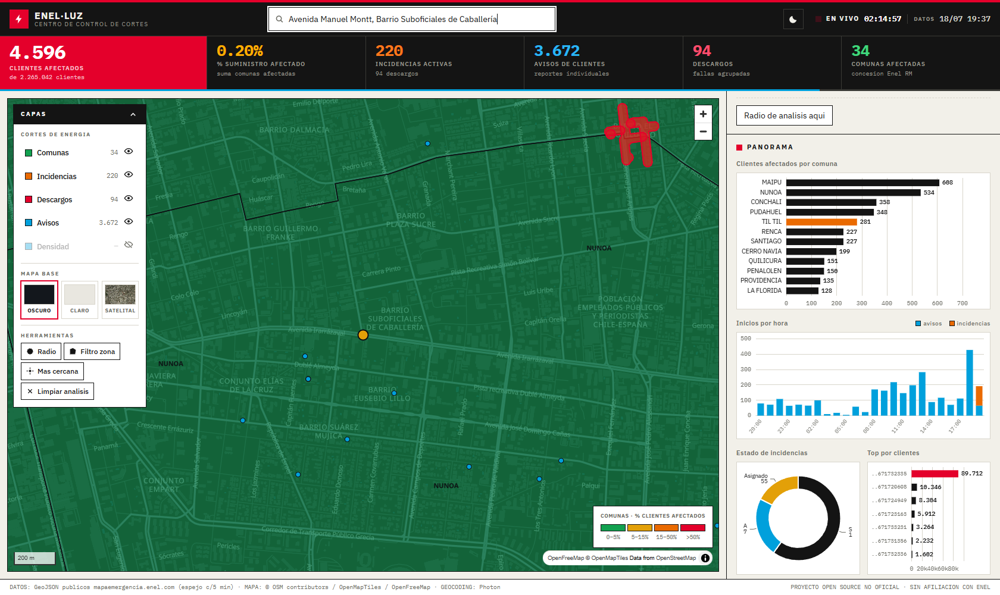
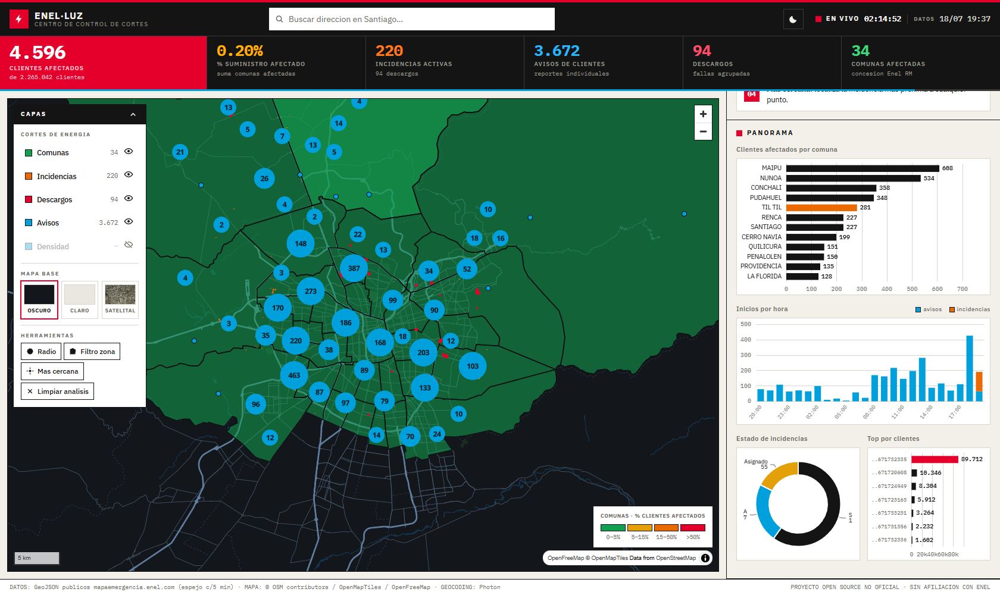

# ENEL·LUZ — Centro de Control de Cortes de Energía

Visor de **control de mando** para los cortes de energía de Enel Chile (zona RM), diseñado bajo una estricta arquitectura **100% client-side**. Sin backend propio, todo el procesamiento geoespacial ocurre en tiempo real en tu navegador.

> ⚠️ Proyecto **no oficial**, sin afiliación con Enel. Los datos provienen de los archivos GeoJSON públicos que alimentan el mapa oficial de cortes, espejados en este repo cada 5 minutos mediante GitHub Actions.


## 🚀 ¿Por qué es mejor que el mapa oficial de Enel?

El mapa oficial de Enel sufre de tiempos de carga prolongados, un diseño genérico de Google Maps sobrecargado visualmente, y carece de herramientas de análisis para el usuario. **ENEL·LUZ** soluciona esto mediante:

1. **Rendimiento Extremo**: Al descargar los datos crudos (GeoJSON) y procesarlos en el cliente con Turf.js, el mapa vuela. No hay tiempos de espera por consultas lentas a bases de datos en el servidor.
2. **Diseño de "Panel de Instrumentos" (Flat Design)**: En lugar del clásico mapa blanco con burbujas, ENEL·LUZ utiliza un diseño estricto tipo papel y tinta, con jerarquía basada en bloques de colores sólidos (cero sombras, cero gradientes). Esto reduce la fatiga visual y permite detectar las zonas críticas instantáneamente.
3. **Analítica Integrada**: El mapa oficial solo te muestra dónde hay cortes. Esta plataforma incluye un panel lateral con gráficos en vivo (Apache ECharts) que te permiten ver el ranking de las peores incidencias, el flujo histórico de reportes por hora, y un desglose por estado, ofreciendo un verdadero *centro de mando* de la crisis.
4. **Herramientas de Geoproceso Clientes**: Puedes dibujar zonas en el mapa para filtrar datos, hacer clics para ver incidencias en un radio de 500m, y utilizar un buscador nacional que te dice si tu casa está dentro de un polígono de corte sin necesidad de cruzar datos con el servidor de Enel.

---

## 📸 Interfaz y Funcionalidades

### 1. Panel Principal y Mapa Vectorial
La vista principal ofrece un mapa interactivo renderizado por MapLibre GL JS, con tres mapas base (Oscuro, Claro y Satelital). A la izquierda, un gestor de capas estilo Kepler.gl te permite controlar la visibilidad y ver el conteo en tiempo real de trafos, descargos y avisos.



### 2. Panel de Análisis y Buscador Inteligente
El panel lateral derecho alberga herramientas interactivas. Cuenta con un buscador (geocoding vía Photon) que cubre todo Chile y te permite saltar a tu dirección para confirmar si está afectada. Además, incluye herramientas de selección por radio, dibujo de polígonos libres y localización de incidencias más cercanas.



### 3. Analítica y Gráficos Interactivos
Mientras navegas por el mapa, los gráficos de la barra lateral se actualizan. Estos muestran el Top 10 de incidencias más grandes, la evolución temporal de los reportes, y la proporción de clientes afectados por comuna en una escala semaforizada.



---

## Arquitectura

```text
Enel (GeoJSON públicos, sin CORS)
   │  GitHub Actions cron */5 min  (.github/workflows/update-data.yml)
   ▼
public/data/*.geojson          ← espejo mismo-origen, commit solo si hay cambios
   │  build estático (Vite + TS vanilla)
   ▼
GitHub Pages                   (.github/workflows/deploy.yml)
```

Costo total de infraestructura: **$0** (Actions y Pages son gratis en repos públicos).

## Desarrollo

```bash
npm install
npm run fetch-data   # descarga/actualiza el espejo en public/data/
npm run dev          # entorno de desarrollo en http://localhost:5173
npm run build        # build de producción a dist/
npm run preview      # sirve dist/ en http://localhost:4173
```

## Deploy propio (fork)

1. Haz fork o sube este código a un repo **público**
2. **Settings → Pages → Build and deployment → GitHub Actions**
3. Listo: `deploy.yml` publica en cada push a `main` y `update-data.yml` mantiene los datos frescos solo (sus commits no disparan rebuilds).

> GitHub desactiva los workflows programados tras 60 días sin actividad del repo; se reactivan con un clic en la pestaña Actions.

## Stack Tecnológico

- **Vite 6** · **TypeScript vanilla**
- **MapLibre GL JS** (Renderizado WebGL rápido)
- **Apache ECharts** (Visualización de datos)
- **Turf.js** (Geoprocesos vectoriales)
- **OpenFreeMap / OpenMapTiles** (Mapas base vectoriales gratuitos)
- **Esri World Imagery** (Satélite)
- **Photon / Nominatim** (Geocoding de OpenStreetMap)

## Licencia

MIT — ver [LICENSE](LICENSE). Los datos de cortes pertenecen a Enel Chile; los mapas base a © OpenStreetMap contributors / OpenMapTiles / Esri según corresponda.
