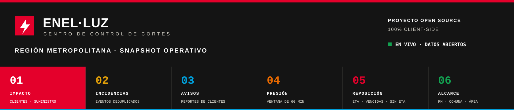
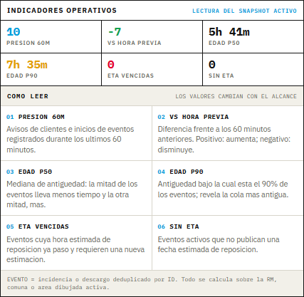
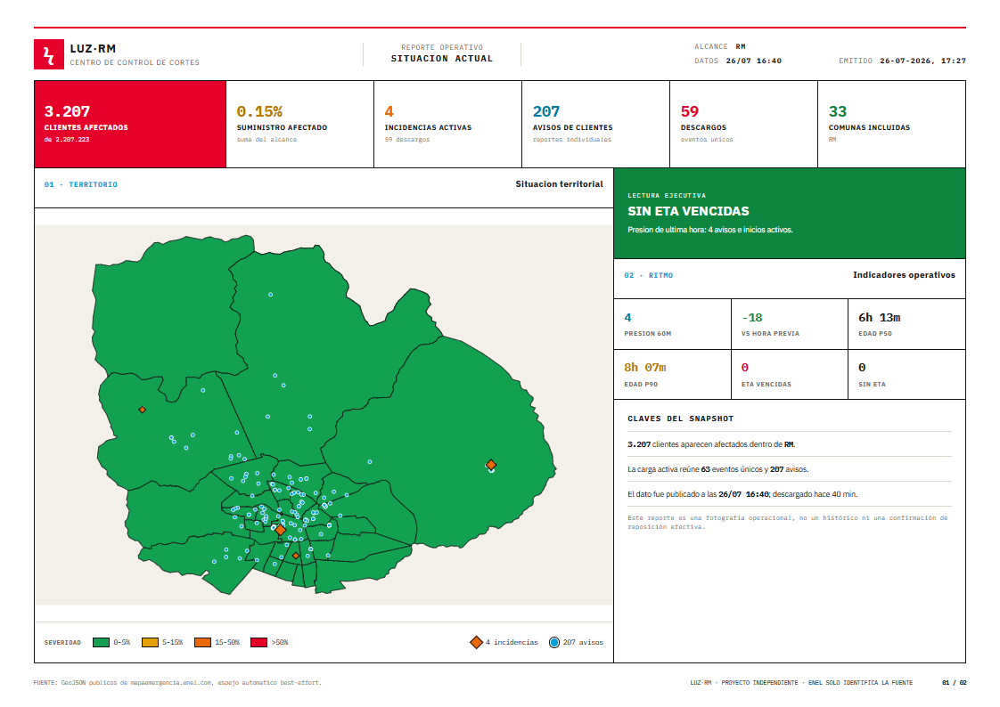
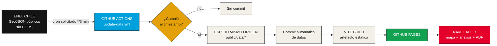
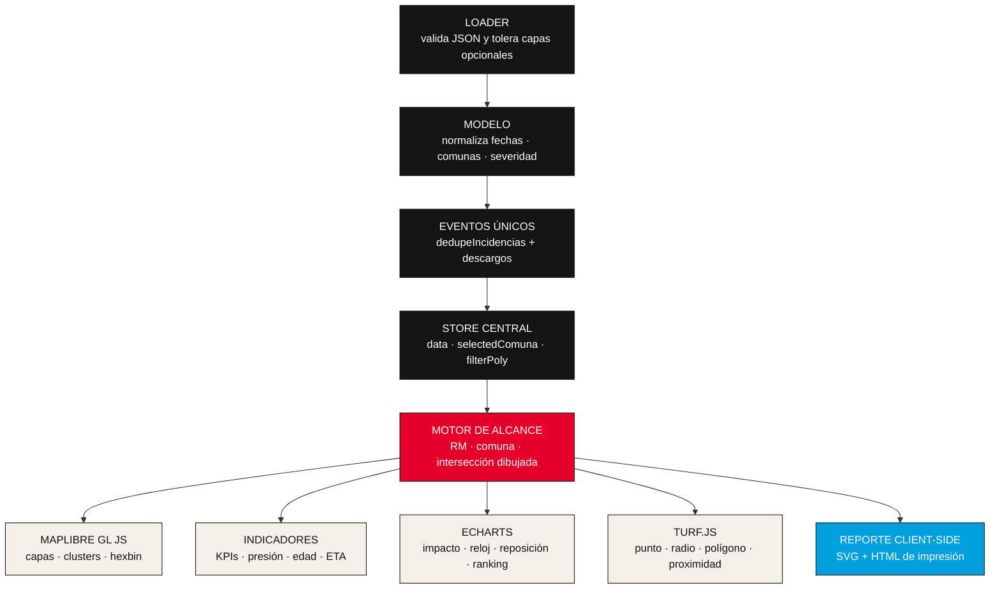

<p align="center">
  
</p>

<p align="center">
  <strong>Un centro de mando territorial para interpretar cortes de energía en la Región Metropolitana.</strong><br>
  Mapa, alcance espacial, presión operativa, reposición y reportes PDF en una sola aplicación estática.
</p>

<p align="center">
  <a href="https://geoidegeoidal.github.io/enel-luz/"><strong>ABRIR CENTRO DE CONTROL ↗</strong></a>
  &nbsp;·&nbsp;
  <a href="#puesta-en-marcha">EJECUTAR LOCALMENTE</a>
  &nbsp;·&nbsp;
  <a href="#arquitectura">VER ARQUITECTURA</a>
</p>

> [!IMPORTANT]
> **Proyecto no oficial y sin afiliación con Enel.** Los datos provienen de los GeoJSON públicos que alimentan el mapa de emergencia de Enel Chile. El espejo automático es _best-effort_: la hora **DATOS** de la interfaz indica la publicación efectiva del snapshot.

---

## 01 · Qué permite responder

| IMPACTO | TERRITORIO | TIEMPO OPERATIVO |
|:--|:--|:--|
| ¿Cuántos clientes y qué porcentaje del suministro están afectados? | ¿En qué comunas, incidencias o áreas dibujadas se concentra la situación? | ¿La presión aumenta? ¿Qué ETA están vencidas, próximas o ausentes? |
| KPIs deduplicados y severidad por umbrales. | Mapa, clusters, hexbin y _cross-filter_ espacial. | Reloj ±12 h, edades P50/P90 y escala de reposición. |

La aplicación no es solamente un mapa de polígonos. Convierte el snapshot activo en una lectura operacional consistente: cualquier selección por **RM**, **comuna** o **área dibujada** actualiza mapa, indicadores, gráficos, diagnóstico y reporte.

---

## 02 · Vistas del centro de mando

### Panorama territorial

La vista principal une la banda KPI, el mapa MapLibre, el gestor de capas y el panorama analítico. Los polígonos representan severidad comunal; las incidencias, descargos y avisos siguen disponibles como capas operativas independientes.


### Indicadores con definición visible

Los valores no quedan a interpretación del lector. La guía **CÓMO LEER** define la ventana temporal, el signo de la variación, los percentiles de edad y el estado de las ETA. También declara el alcance activo y la deduplicación de eventos.

<p align="center">
  
</p>

| INDICADOR | LECTURA OPERATIVA |
|:--|:--|
| **Presión 60m** | Avisos e inicios de eventos registrados durante los últimos 60 minutos. |
| **Vs hora previa** | Diferencia frente a los 60 minutos anteriores: positivo aumenta; negativo disminuye. |
| **Edad P50** | Mediana de antigüedad de los eventos activos. |
| **Edad P90** | Cola más antigua: el 90% de los eventos tiene una edad igual o menor. |
| **ETA vencidas** | Eventos cuya estimación de reposición ya pasó y requiere actualización. |
| **Sin ETA** | Eventos activos sin fecha estimada de reposición publicada. |

> **Método:** “evento” significa incidencia o descargo deduplicado por ID. Las métricas se calculan sobre el snapshot y alcance activos; no constituyen una serie histórica de eventos cerrados.

### Reloj, reposición y prioridad

El **reloj operativo ±12 h** mantiene `AHORA` en el centro: inicios y avisos quedan a la izquierda; ETA futuras y vencidas, a la derecha. La escala de reposición ordena los eventos por urgencia y el ranking evita inflar clientes cuando una incidencia tiene varias geometrías.


### Diagnóstico espacial

El buscador está limitado a la RM. También es posible consultar un radio de 500 m, dibujar un polígono de análisis y localizar la incidencia más cercana. El resultado conserva el mismo contexto visual del centro de mando.


### Reporte regional o comunal en PDF

El reporte reutiliza el alcance activo y genera dos páginas A4 apaisadas sin enviar datos a un servidor. El mapa editorial muestra simultáneamente severidad comunal, incidencias activas como rombos naranjas y avisos de clientes como puntos cian.

<p align="center">
  
</p>

- **Página 1:** alcance, frescura, KPIs, mapa operacional, lectura ejecutiva e indicadores.
- **Página 2:** reloj ±12 h, escala ETA, eventos prioritarios, impacto comunal y metodología.
- **Exportación:** `IMPRIMIR / GUARDAR PDF` utiliza el diálogo nativo del navegador.

---

## 03 · Arquitectura

### Flujo de datos y publicación


```mermaid
flowchart LR
  A["ENEL CHILE<br/>GeoJSON públicos<br/>sin CORS"] -->|cron solicitado */5 min| B["GITHUB ACTIONS<br/>update-data.yml"]
  B --> C{"¿Cambió<br/>el timestamp?"}
  C -->|no| D["Sin commit"]
  C -->|sí| E["ESPEJO MISMO ORIGEN<br/>public/data/*"]
  E --> F["Commit automático<br/>de datos"]
  F --> G["VITE BUILD<br/>artefacto estático"]
  G --> H["GITHUB PAGES"]
  H --> I["NAVEGADOR<br/>mapa + análisis + PDF"]

  classDef source fill:#141414,color:#fff,stroke:#141414;
  classDef action fill:#00a0dc,color:#fff,stroke:#141414;
  classDef decision fill:#e3a008,color:#141414,stroke:#141414;
  classDef data fill:#f2f0e9,color:#141414,stroke:#141414;
  classDef publish fill:#12a150,color:#fff,stroke:#141414;
  classDef client fill:#e4002b,color:#fff,stroke:#141414;
  class A source;
  class B action;
  class C decision;
  class D,E,F,G data;
  class H publish;
  class I client;
```

El navegador no consulta directamente a Enel porque el origen no entrega cabeceras CORS. GitHub Actions mantiene un espejo estático y solo confirma el nuevo estado después de descargar las capas. Cada cambio de datos reconstruye el artefacto completo de Pages.

### Arquitectura dentro del navegador


```mermaid
flowchart TB
  L["LOADER<br/>valida JSON y tolera capas opcionales"] --> M["MODELO<br/>normaliza fechas · comunas · severidad"]
  M --> U["EVENTOS ÚNICOS<br/>dedupeIncidencias + descargos"]
  U --> S["STORE CENTRAL<br/>data · selectedComuna · filterPoly"]
  S --> X["MOTOR DE ALCANCE<br/>RM · comuna · intersección dibujada"]

  X --> MAP["MAPLIBRE GL JS<br/>capas · clusters · hexbin"]
  X --> KPI["INDICADORES<br/>KPIs · presión · edad · ETA"]
  X --> CH["ECHARTS<br/>impacto · reloj · reposición · ranking"]
  X --> GEO["TURF.JS<br/>punto · radio · polígono · proximidad"]
  X --> PDF["REPORTE CLIENT-SIDE<br/>SVG + HTML de impresión"]

  classDef core fill:#141414,color:#fff,stroke:#141414;
  classDef scope fill:#e4002b,color:#fff,stroke:#141414;
  classDef output fill:#f2f0e9,color:#141414,stroke:#141414;
  classDef info fill:#00a0dc,color:#fff,stroke:#141414;
  class L,M,U,S core;
  class X scope;
  class MAP,KPI,CH,GEO output;
  class PDF info;
```

### Capas del proyecto

| CAPA | RESPONSABILIDAD | ARCHIVOS PRINCIPALES |
|:--|:--|:--|
| Datos | Descarga, validación y modelo normalizado. | `scripts/fetch-data.mjs`, `src/data/` |
| Estado | Snapshot y alcance espacial compartidos. | `src/state.ts`, `src/main.ts` |
| Mapa | Estilos base, fuentes, capas, popups y filtros. | `src/map/`, `src/geo/` |
| Analítica | KPIs y cuatro visualizaciones ECharts. | `src/charts/charts.ts` |
| Interfaz | Paneles, herramientas, leyendas y temas. | `src/ui/ui.ts`, `src/style.css` |
| Reporte | Modelo editorial, SVG operacional e impresión. | `src/report/report.ts` |
| Operación | Actualización de datos, build y Pages. | `.github/workflows/` |

---

## 04 · Reglas de integridad

Estas decisiones evitan que una interfaz visualmente correcta entregue cifras equivocadas:

- **Una incidencia puede tener varios polígonos.** `CLITOTAL` ya representa el total del evento: se deduplica por `INCIDENCIA` y se usa el máximo; nunca se suma entre geometrías.
- **Una comuna puede venir fragmentada.** Se combinan todas sus geometrías, se suman afectados y `CLIENTESTOTAL` se considera una sola vez.
- **Comuna + polígono dibujado usa intersección real.** No basta comprobar cada geometría por separado.
- **Las fechas se interpretan en `America/Santiago`.** No se hereda la zona horaria del navegador.
- **El reloj no es historia persistida.** Describe únicamente eventos presentes en el snapshot activo.
- **La frescura se muestra, no se presume.** El cron de GitHub es _best-effort_ y puede atrasarse.

---

## 05 · Tecnología

| VISUALIZACIÓN | GEOPROCESO | PLATAFORMA |
|:--|:--|:--|
| MapLibre GL JS | Turf.js | Vite 6 + TypeScript |
| Apache ECharts | Photon + Nominatim | GitHub Actions + Pages |
| OpenFreeMap / OpenMapTiles | GeoJSON en el navegador | IBM Plex Sans + Mono |

La arquitectura es **100% client-side**: no existe backend propio, base de datos ni telemetría de usuario.

---

## 06 · Puesta en marcha

Requisitos: Node.js y Google Chrome para las pruebas E2E/capturas.

```bash
npm install
npm run fetch-data       # actualiza el espejo en public/data/
npm run dev              # desarrollo: http://localhost:5173
npm test                 # pruebas unitarias
npm run build            # producción: dist/
npm run preview          # preview: http://localhost:4173
node scripts/smoke.mjs http://localhost:4173/
```

Generación reproducible del reporte:

```bash
node scripts/report-pdf.mjs http://localhost:4173/ RM output/pdf/reporte-rm.pdf
node scripts/report-pdf.mjs http://localhost:4173/ COLINA output/pdf/reporte-colina.pdf
```

Capturas editoriales del README:

```bash
node scripts/readme-shots.mjs http://localhost:4173/
```

---

## 07 · Publicar un fork

1. Haz un fork en un repositorio público.
2. En **Settings → Pages → Build and deployment**, selecciona **GitHub Actions**.
3. Un push a `main` ejecutará `.github/workflows/deploy.yml`.
4. Cuando `update-data.yml` detecte datos nuevos, generará un commit y reconstruirá Pages.

> [!NOTE]
> GitHub puede desactivar workflows programados después de 60 días sin actividad. Se reactivan desde la pestaña **Actions**.

---

## 08 · Licencia y atribuciones

Código bajo licencia [MIT](LICENSE).

- Datos de cortes: Enel Chile.
- Cartografía: © OpenStreetMap contributors, OpenMapTiles, OpenFreeMap y Esri, según la capa utilizada.
- Geocoding: Photon y Nominatim.

**ENEL·LUZ es un proyecto independiente, abierto y no oficial.**
